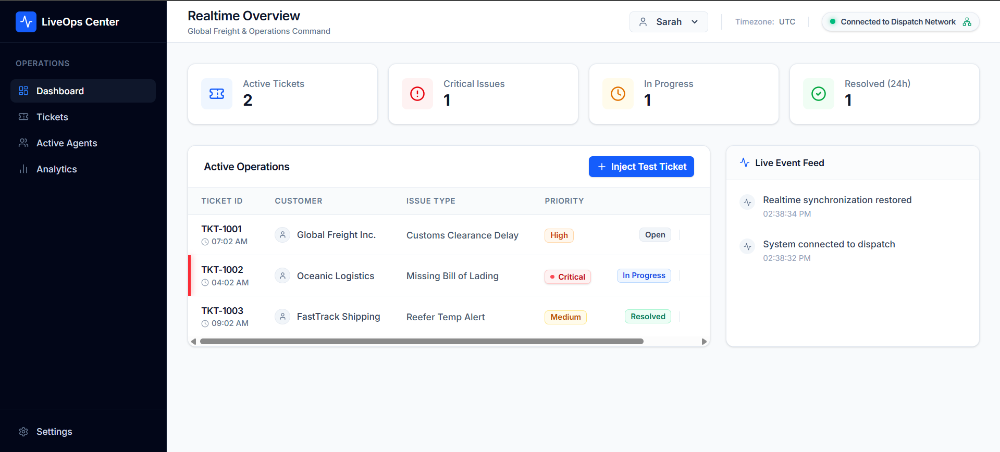
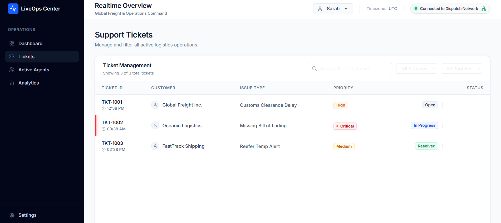

# 🚚 LiveOps Center — Realtime Collaborative Helpdesk

## 📸 Project Preview




🔗 Live Demo: https://liveops-teal.vercel.app/dashboard

---

A **Realtime Collaborative Operations Dashboard** built for logistics and freight support teams to manage high-priority support tickets without agent collisions or conflicting updates.

This project focuses on **modern realtime frontend engineering**, including:

* WebSocket synchronization
* Collaborative ticket locking
* Realtime presence systems
* Graceful degradation handling
* Enterprise dashboard architecture

Inspired by real-world operational software used in logistics and dispatch environments.

---

## 🚀 Features

### ✅ Requirement 1 — Live Ticket Board

* Realtime ticket dashboard
* Persistent Socket.io-client connection
* Instant ticket synchronization across multiple browser windows
* Live activity feed with realtime updates
* Smooth realtime animations using Framer Motion
* No polling or setInterval usage

### ✅ Requirement 2 — Presence & Collaborative Locking

* Realtime collaborative ticket locking
* Server-authoritative lock validation
* 🔒 Lock indicators with ownership awareness
* "Locked by [Agent Name]" UI state
* Edit restrictions for non-owners
* Multi-user operator simulation
* Realtime activity logging for collaborative actions

### ✅ Requirement 3 — Release Protocol & Graceful Degradation

* Realtime unlock synchronization
* Ghost lock auto-cleanup on disconnect
* WebSocket disconnect detection
* Global reconnect warning banner
* Automatic lock recovery
* Realtime connection awareness system
* Graceful UI degradation during network failures

---

## 🧠 Key Design Decisions

* **Server-Authoritative Concurrency**
  Lock ownership is validated entirely on the Socket.io server to prevent race conditions and conflicting ticket edits.

* **Centralized Socket Architecture**
  Socket listeners are managed centrally to avoid duplicate listeners, React Strict Mode issues, and memory leaks.

* **Zustand as Single Source of Truth**
  Shared realtime state is synchronized globally through modular Zustand stores.

* **Enterprise Dashboard Design**
  Inspired by Linear, Vercel, and modern logistics operations software with realtime operational visibility.

* **Graceful Failure Handling**
  The UI detects disconnects, auto-recovers from websocket interruptions, and prevents stale ticket locks.

---

## 📂 Project Structure

```text
liveops-center/
│
├── public/                          # README screenshots & public assets
│
├── server/
│   ├── server.mjs                   # Socket.io realtime backend
│   └── package.json
│
├── src/
│   ├── app/
│   │   ├── dashboard/
│   │   │   ├── analytics/
│   │   │   ├── active-agents/
│   │   │   ├── tickets/
│   │   │   ├── settings/
│   │   │   └── page.tsx
│   │   ├── layout.tsx
│   │   └── globals.css
│   │
│   ├── components/
│   │   ├── layout/
│   │   ├── shared/
│   │   └── ui/
│   │
│   ├── features/
│   │   ├── tickets/
│   │   ├── realtime/
│   │   ├── analytics/
│   │   ├── agents/
│   │   └── settings/
│   │
│   ├── lib/
│   │   ├── socket.ts
│   │   ├── constants.ts
│   │   └── utils.ts
│   │
│   ├── store/
│   │   ├── useTicketStore.ts
│   │   ├── useRealtimeStore.ts
│   │   └── useUiStore.ts
│   │
│   └── types/
│
├── README.md
└── prompts.md
```

---

## 🛠️ Technologies Used

### Frontend

* Next.js 15 (App Router)
* TypeScript
* Tailwind CSS
* Zustand
* Framer Motion
* Lucide React
* Recharts

### Backend

* Node.js
* Express.js
* Socket.io

### Realtime Architecture

* WebSockets
* Socket.io-client
* In-memory lock management using JavaScript Map()

### Deployment

* Vercel (Frontend)
* Render (Realtime Socket.io Backend)

---

## ⚡ Realtime System Architecture

```text
Frontend (Next.js)
        ↓
Socket.io-client Connection
        ↓
Realtime Socket.io Server
        ↓
Server-Authoritative Lock Map
```

### Lock Flow

1. User clicks a ticket
2. Frontend emits `lock_ticket`
3. Server validates lock ownership
4. Lock state broadcasts instantly to all clients
5. Other operators see locked state in realtime

### Ghost Disconnect Recovery

If an operator disconnects unexpectedly:

* server detects socket disconnect
* associated locks are automatically released
* unlock state broadcasts globally
* tickets instantly become editable again

---

## 🧪 How to Run the Project

### 1. Clone the Repository

```bash
git clone <repository-url>
cd liveops-center
```

---

### 2. Install Frontend Dependencies

```bash
npm install
```

---

### 3. Install Backend Dependencies

```bash
npm run dev:server   # Note: Since server.mjs is in the root, standard npm install installs everything
```

---

### 4. Configure Environment Variables

Create a `.env.local` file in the root:

```env
NEXT_PUBLIC_SOCKET_URL=http://localhost:3001
```

---

### 5. Start the Realtime Backend

```bash
npm run dev:server
```

---

### 6. Start Next.js Frontend

```bash
npm run dev
```

---

### 7. Test Realtime Collaboration

1. Open two browser windows
2. Visit:
   http://localhost:3000/dashboard
3. Lock a ticket in Window A
4. Watch Window B update instantly
5. Test unlock flow and disconnect recovery

---

## 🌐 Production Deployment

### Frontend Deployment

Deploy the Next.js frontend to:

* Vercel

### Backend Deployment

Deploy the Socket.io server separately to:

* Render

### Important Production Notes

* WebSockets require a persistent Node.js server
* Vercel serverless functions are NOT suitable for native Socket.io servers
* Configure CORS properly between Vercel and Render
* Use secure `wss://` websocket connections in production

---

## 🤖 AI Assistance Disclaimer

AI tools were used for:

* realtime architecture planning
* websocket lifecycle debugging
* Zustand state organization
* Socket.io integration guidance
* concurrency handling strategies
* deployment architecture validation

All code was manually implemented, tested, debugged, and refined to ensure scalable realtime behavior and proper engineering practices.

Detailed AI interactions are documented in:
`prompts.md`

---

## 👨‍💻 Author

**Krishna Kumar**  
Frontend Developer Intern — Prodesk IT
